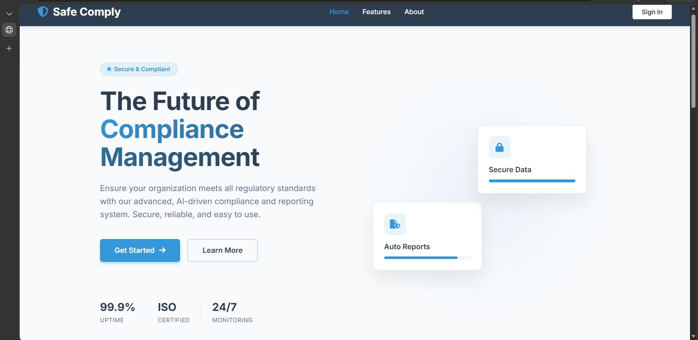
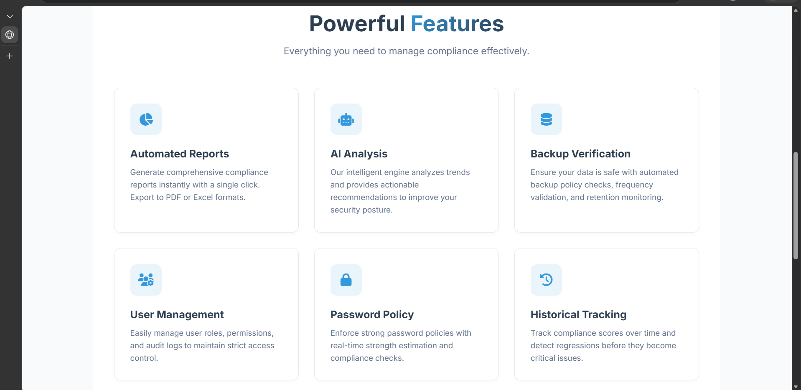
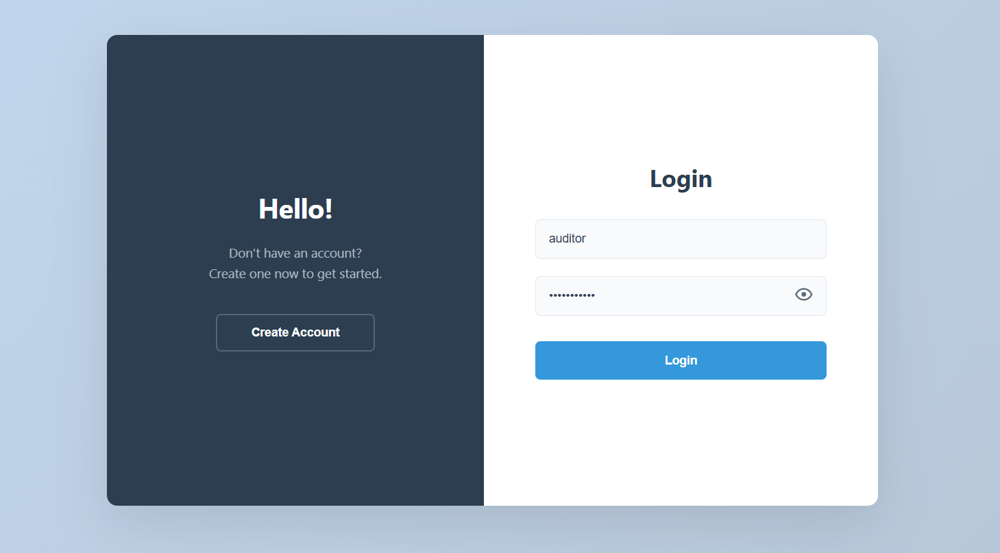
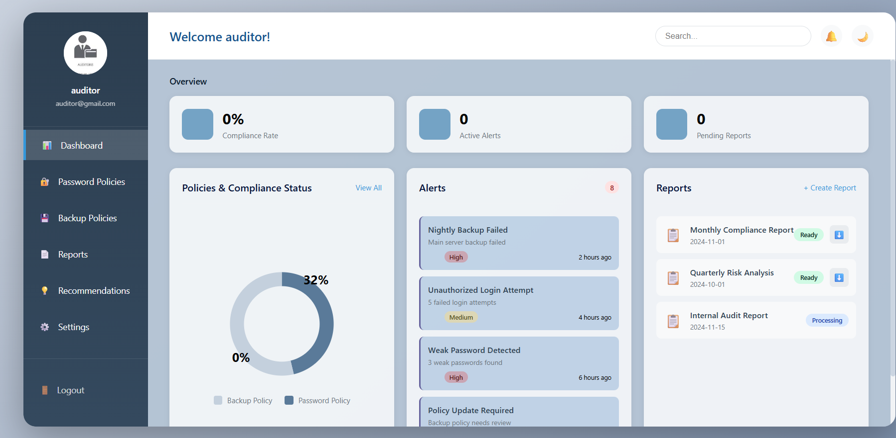
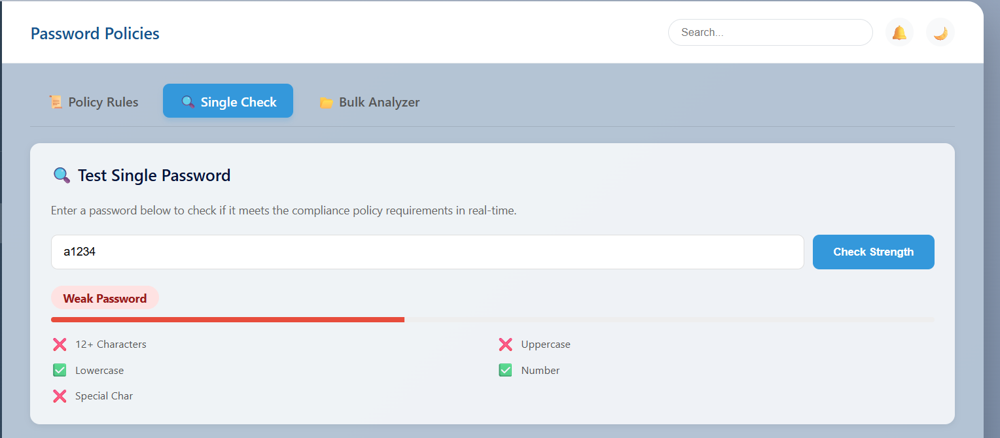

# safe-comply
An integrated cybersecurity compliance system that aims to enhance data protection and raise the level of security within organizations through password policy management, compliance monitoring, user tracking, and continuous security risk analysis.
# SafeComply – Security Compliance Management System

SafeComply is a web-based system designed to enhance organizational security by managing password policies, monitoring compliance status, and performing risk analysis.

## 🚀 Features
- Password policy management
- Compliance monitoring dashboard
- Risk analysis and reporting
- User-friendly web interface
- Admin control panel

## 🛠️ Technologies Used
- Python (Backend)
- HTML, CSS, JavaScript (Frontend)
- SQLite / Database
- Git & GitHub for version control

## 📷 Screenshots

## Screenshots











### Compliance Page


## ⚙️ How to Run the Project

1. Clone the repository
```bash
